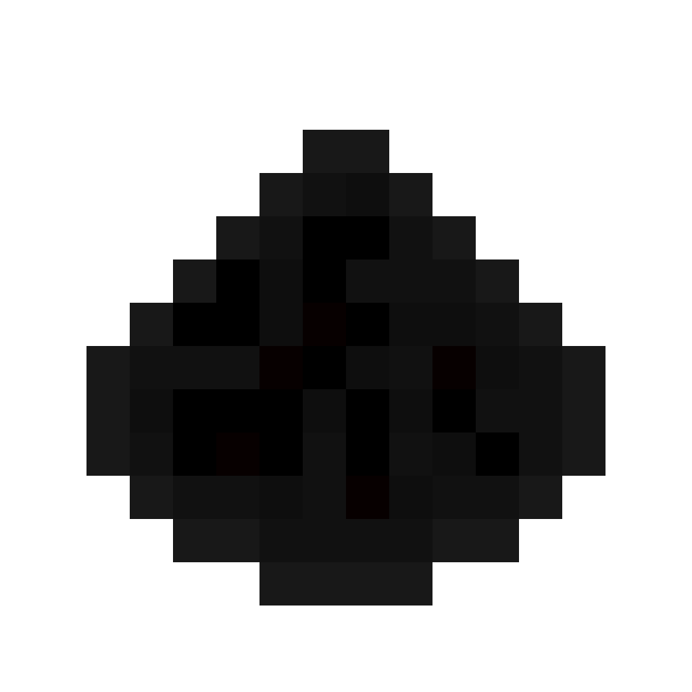

# WHEN USING: copy the zlibd.dll into the place where the BedrockPowder executeable exists
# zlibd.dll is found inside Zlib/Debug if not found build the zlib then it will be found

    <picture>
        
    </picture>
     
    <b>BedrockPowder is open-source server software</b>
     
    <b>for Minecraft: Bedrock Edition written on C++</b>

<h1>Currently in development!</h1>
    

        This project is under development.  Most of the code consists of stubs so that there is at least some kind of basis.
    

<h1>Navigation</h1>
    <h4>1. <a href=README.md#getting-started>Getting Started</a></h3>
    <h4>2. <a href=README.md#special-thanks>Special Thanks</a></h3>

<h1>Getting Started</h1>
    <h2>How to write plugins?</h3>
        <h3>This feature is not yet available</h2>
    <h2>Configuration file</h2>
        <h3>Temporarily removed</h3>

<h1>Special Thanks</h1>
    <h4>https://github.com/MFDGaming/CBinaryStream - for BinaryStream</h4>
    <h4>https://github.com/ProjectKatana/Katana - for help in opening RakNet server and using it.</h4>
